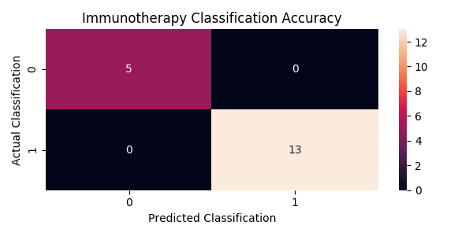
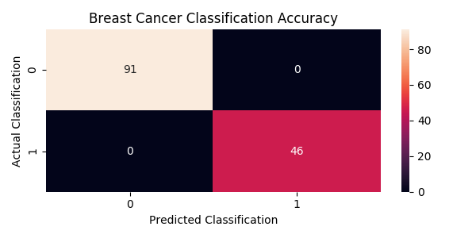

# RF-Classification-Base
<em>RF-Classification-Base</em> is a succinct, dynamic, and easily-modifiable implementation of the random forest ensemble learning method in Python 3. Given a data set, it will train, test, and visualize a random forest classifier. The script works regardless of the contents of the data or how many features the data has, so it can easily be slotted into other programs. The highlight of this project is the "train_test_display" function, which takes in a matrix of features, their corresponding classifications, and the title of the data. There are also two short examples that show how to use the "train_test_display" function, one of which uses data from immunotherapy treatment, and the other of which uses data from breast cancer patients and their respective outcomes.  

## Examples

### Immunotherapy Model Confusion Matrix:

### Breast Cancer Model Confusion Matrix:

## Features

* Visualized data in the form of a confusion matrix for each model that is trained
* Customizable plotting using the Matplotlib package
* Easy-to-use data import features from pandas package
* Modifiable classification algorithm provided by scikit-learn package

## Deployment

* Clone or download the project. The script was tested in PyCharm and as well as through a Unix terminal
* Settings for test data and the number of estimators in the random forest model can both be found and tweaked in the "train_test_display" function.
    * Complex datasets may require a higher number of estimators in order to train the model with satisfactory accuracy

## License

This project is licensed under the MIT License - see the [LICENSE.md](LICENSE.md) file for details

## Acknowledgments

* The [Immunotherapy](https://archive.ics.uci.edu/ml/datasets/Immunotherapy+Dataset) data is sourced from the University of California, Irvine's Machine Learning Repository in accordance with their user agreements
* The [Breast Cancer](https://archive.ics.uci.edu/ml/datasets/Breast+Cancer) data is sourced from the University of California, Irvine's Machine Learning Repository in accordance with their user agreements